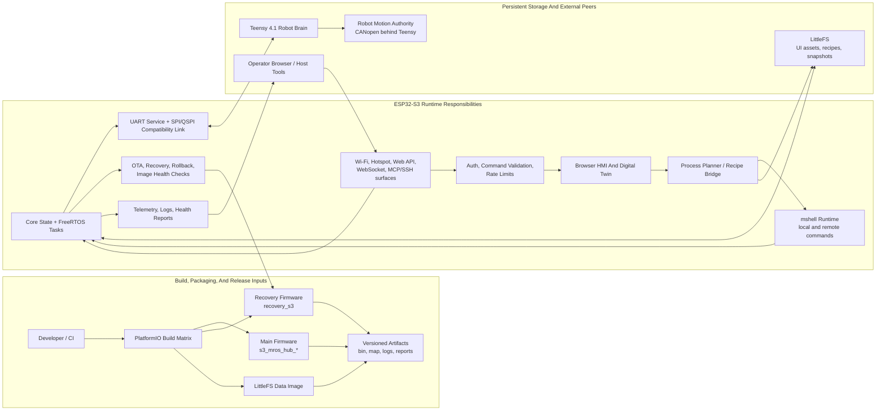

# MROS DEUSCARA ESP32-S3 Firmware

[Security policy](SECURITY.md) · [Release process](RELEASING.md)

Default language: English

Documentation: [English docs](docs/README.md) | [Turkish docs](docs/README.tr.md)

`ESP32S3N32R16V-UI` is the ESP32-S3 firmware repository for the MROS DEUSCARA UI, network, shell, update, recovery and service layers. The project is built with PlatformIO on top of ESP-IDF and is managed together with a separate recovery image.

## System Profile

| Component | Value |
|:---:|:---|
| Main target | `esp32-s3-devkitc-1-n32r16v-local` |
| Default env | `s3_mros_hub_n32` |
| Build system | PlatformIO + ESP-IDF |
| Main source entry | `main/` (`src_dir = main`) |
| Core modules | `src/` |
| Recovery application | `recovery_app/` |
| Filesystem | LittleFS |

## Architecture



## Quick Start

1. Verify PlatformIO:

```bash
pio --version
```

2. Build the main firmware:

```bash
pio run -e s3_mros_hub_n32
```

3. Upload to the device:

```bash
pio run -e s3_mros_hub_n32 -t upload
```

4. Open the serial monitor:

```bash
pio device monitor -b 115200
```

5. Build the recovery image:

```bash
pio run -d recovery_app -e recovery_s3
```

## Build Profiles

| Profile | Purpose | Command |
|:---:|:---|:---|
| `s3_mros_hub_n32` | Main 32 MB flash build | `pio run -e s3_mros_hub_n32` |
| `s3_mros_hub_n16` | 16 MB flash compatibility | `pio run -e s3_mros_hub_n16` |
| `s3_mros_hub_n8` | 8 MB flash compatibility | `pio run -e s3_mros_hub_n8` |
| `s3_mros_hub_ddr_n32` | DDR/PSRAM120 variant | `pio run -e s3_mros_hub_ddr_n32` |
| `*_dbg` profiles | Debug-optimized test flow | `pio run -e <profile_name>` |
| `recovery_s3` | Recovery firmware | `pio run -d recovery_app -e recovery_s3` |

## Repository Layout

| Path | Contents |
|:---:|:---|
| `main/` | PlatformIO active source directory and entry component definition |
| `src/` | Functional modules: core, shell, net, control, platform and drivers |
| `components/` | External/custom component packages |
| `managed_components/` | ESP-IDF managed component outputs |
| `recovery_app/` | Separate recovery firmware project |
| `scripts/` | Build, upload, artifact and guard scripts |
| `tools/` | Helper validation scripts |
| `boards/` | Custom board definitions |
| `data/` | LittleFS data area |

## Git Tracking Policy

Only build-required source and configuration files are tracked. Local caches, generated artifacts and secrets are excluded by `.gitignore`.

| Tracked | Not tracked |
|:---:|:---|
| `src/`, `main/`, `components/`, `scripts/`, `tools/` | `.pio/`, `.b/`, `.bc/`, `.c/`, `build/`, `output/` |
| `platformio.ini`, partition tables | `platformio.local.ini` variants |
| `sdkconfig.defaults*`, `sdkconfig.s3_mros_hub_n32` | Generated `sdkconfig`, `sdkconfig.old`, `sdkconfig.local` |
| `recovery_app` source and defaults | Temporary build/cache folders under `recovery_app` |
| `.env.example` | `.env`, `.env.*`, `*.env`, `*.env.*` |

## Cross-System Link

For the Teensy 4.1 wiring and service-link contract, see:

- `TEENSY41_CONNECTIONS.md`
- [docs/README.md](docs/README.md)
- [docs/web-ui-api-operator-guide.md](docs/web-ui-api-operator-guide.md)

## DEUSCARA Repository Family

This repository is the ESP32-S3 UI, network, service and recovery firmware layer of MROS DEUSCARA. Related private repositories in the same license family:

| Repository | Role |
|:---:|:---|
| [ESP32S3N32R16V-UI](https://github.com/MCC45TR/ESP32S3N32R16V-UI) | ESP32-S3 UI, network services, recovery/update and web/runtime interface |
| [TEENSY41-Brain](https://github.com/MCC45TR/TEENSY41-Brain) | Deterministic control, `mshell`, field diagnostics and motor/communication layer |
| [Robot-CAD](https://github.com/MCC45TR/Robot-CAD) | DEUSCARA mechanical CAD assemblies, part models and electronics placement references |

## License

This repository is distributed under the `MCC Academic Non-Commercial Source-Available License v1.0` terms in `LICENSE`.
