# Teensy Link And Runtime Bridge Guide

Language: English | [Turkish](teensy-link-runtime-guide.tr.md)

This document explains how the ESP32-S3 side connects to the Teensy 4.1 robot brain and how web/runtime data should flow into robot-safe Teensy decisions.

## Link Summary

| Link | ESP32 pins | Teensy pins | Current status |
| --- | --- | --- | --- |
| UART service link | TX 17, RX 18, CTS 16 | RX 21, TX 20, RTS 19 | Safe immediate bring-up path |
| Classic SPI compatibility | CS 10, MOSI 11, SCK 12, MISO 13 | CS 6, IO0 3, SCK 2, IO1 4 | Current compatibility path |
| Handshake | ESP_READY 14, T41_READY 15, IRQ 39, RESET 40 | ESP_READY 9, T41_READY 8, ESP_IRQ 10, ESP_RESET 11 | Required for robust peer state |
| True 4-bit QuadSPI | WP/HD not assigned in current ESP32 config | IO2 33, IO3 5 plus IO0/IO1 | Future validation only |

## UART Runtime Layers

| Layer | Purpose |
| --- | --- |
| Plain text | Bring-up logs and simple diagnostics |
| `STATUS:BOOT` | ESP32 boot/status line |
| `UART_Wifi_Status_t` COBS | Wi-Fi/network state toward Teensy |
| `MSHELL2:` | Text remote shell bridge |
| `MSH1` | Binary COBS tunnel |
| `MUS1` | ChaCha20-Poly1305 envelope implemented on both peers; fail-closed by default |

First bring-up rule: use an explicit `MROS_REQUIRE_SECURE_UART=0` lab build on both peers to prove TX/RX/GND before enabling the default fail-closed profile.

The canonical framing, key schedule, replay, and provisioning contract is
[`TEENSY41-Brain/docs/protocol/mus1-secure-uart.md`](https://github.com/MCC45TR/TEENSY41-Brain/blob/main/docs/protocol/mus1-secure-uart.md).
All UART traffic now uses COBS plus a `0x00` delimiter; newline is payload, not a
second framing protocol.

## SPI/QSPI Compatibility

The project name `qspi-esp32s3` remains because the long-term pin contract targets 4-bit QuadSPI/FlexIO1. Current practical bring-up uses classic SPI compatibility:

```text
ESP32 GPIO12 SCK  -> Teensy pin 2
ESP32 GPIO11 MOSI -> Teensy pin 3
ESP32 GPIO13 MISO <- Teensy pin 4
ESP32 GPIO10 CS   <-> Teensy pin 6
ESP32 GPIO14 READY -> Teensy pin 9
ESP32 GPIO15 T41_READY <- Teensy pin 8
```

Do not claim true 4-bit QuadSPI DMA until both sides expose matching physical endpoints and logic-analyzer evidence exists.

## Robot Data Flow

```mermaid
flowchart LR
    subgraph ESP["ESP32-S3 Planning And Service Plane"]
        UI["Web UI / Operator Browser"]
        API["HTTP API / WebSocket / mshell"]
        PLAN["Process Planner And Digital Twin"]
        SNAP["force-snapshot.json\nrecipe, TTL, health rows"]
        VALID["Command Validation\nschema, auth, stale-data checks"]
        LINKMGR["Link Manager\nUART first, SPI/QSPI compatibility"]
    end

    subgraph WIRES["Physical Link Contract"]
        UART["UART TX/RX/CTS\nbring-up and service shell"]
        SPI["Classic SPI compatibility\nSCK, MOSI, MISO, CS"]
        HS["Handshake GPIO\nESP_READY, T41_READY, IRQ, RESET"]
    end

    subgraph T41["Teensy 4.1 Motion Authority"]
        RX["Frame Decode + MSHELL Bridge"]
        SAFE["Safety Supervisor\ntimeouts, limits, watchdog"]
        PREVIEW["Motion Preview / Dry-Run Gate"]
        QUEUE["Motion Queue"]
        RT["Real-Time Control Loop"]
        CAN["CANopen / openCAN Motor Bus"]
        LOG["SD Logger + Telemetry"]
    end

    UI --> API --> PLAN --> SNAP --> VALID
    VALID --> LINKMGR
    LINKMGR <--> UART
    LINKMGR <--> SPI
    LINKMGR <--> HS
    UART <--> RX
    SPI <--> RX
    HS <--> SAFE
    RX --> SAFE --> PREVIEW --> QUEUE --> RT --> CAN
    SAFE --> LOG
    RT --> LOG
    LOG --> API
```



Safe rule: ESP32 may generate a plan, but Teensy decides whether the plan can enter motion preview, motion queue, or live motor output.

## Process Planner Bridge

Browser helpers produce planning outputs:

```js
kin3d_computeProcessFeedPlan({
  mode_id: 'plasma_air_mild_steel_medium',
  material_family: 'mild_steel',
  thickness_mm: 10,
  requested_feed_mm_min: 900,
  vendor_chart_id: 'coupon-chart-row',
  dry_run_passed: true
})
```

Firmware/robot health bridge:

```text
robot health load-json /ESPUSER/robot/force-snapshot.json 5000
robot health
robot health --json
```

Rows loaded with a TTL must become `STALE` when not refreshed. Stale digital twin data must not be treated as healthy runtime evidence.

## Link Diagnostics

ESP32 side:

```text
uart test --duration 10 --json
spi test --duration 10 --json
robot diag linktest uart --duration 10 --json
robot diag linktest qspi --duration 10 --json
robot diag linktest all --duration 10 --json
```

Teensy side:

```text
uart status
uart test --duration 10 --json
comm qspi status
comm qspi test --duration 10 --json
comm qspi clock suggest --json
```

Evidence should include both ends when claiming a working link.

## Safety Boundary

ESP32 must not:

- keep robot motion alive after WebSocket/client loss,
- bypass Teensy safety state,
- directly assume CANopen motor state,
- convert digital twin seed data into production process settings,
- enable welding/plasma/oxy-fuel energy without WPS/vendor chart/dry-run/interlock evidence,
- treat a browser helper output as motor command acceptance.

Teensy must:

- reject stale commands,
- reject unsafe commands,
- validate limits and deadlines,
- own CANopen state,
- log safety transitions,
- expose rejection reasons for operator feedback.
