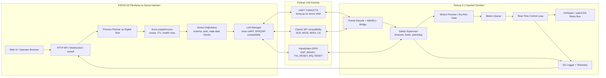

# Teensy Link ve Runtime Bridge Rehberi

Dil: [English](teensy-link-runtime-guide.md) | Türkçe

Bu doküman ESP32-S3 tarafının Teensy 4.1 robot beynine nasıl bağlandığını ve web/runtime verisinin robot-safe Teensy kararlarına nasıl akması gerektiğini açıklar.

## Link Özeti

| Link | ESP32 pinleri | Teensy pinleri | Mevcut durum |
| --- | --- | --- | --- |
| UART servis linki | TX 17, RX 18, CTS 16 | RX 21, TX 20, RTS 19 | Güvenli ilk bring-up yolu |
| Classic SPI compatibility | CS 10, MOSI 11, SCK 12, MISO 13 | CS 6, IO0 3, SCK 2, IO1 4 | Mevcut compatibility path |
| Handshake | ESP_READY 14, T41_READY 15, IRQ 39, RESET 40 | ESP_READY 9, T41_READY 8, ESP_IRQ 10, ESP_RESET 11 | Sağlam peer state için gerekli |
| True 4-bit QuadSPI | Mevcut ESP32 config içinde WP/HD atanmamış | IO2 33, IO3 5 plus IO0/IO1 | Gelecek validasyon konusu |

## UART Runtime Katmanları

| Katman | Amaç |
| --- | --- |
| Plain text | Bring-up log ve basit diagnostik |
| `STATUS:BOOT` | ESP32 boot/status satırı |
| `UART_Wifi_Status_t` COBS | Wi-Fi/network state'i Teensy'ye taşır |
| `MSHELL2:` | Text remote shell bridge |
| `MSH1` | Binary COBS tunnel |
| `MUS1` | Her iki peer'de uygulanan ChaCha20-Poly1305 zarfı; varsayılan fail-closed |

İlk bring-up kuralı: varsayılan fail-closed profile geçmeden önce iki peer'de de açıkça `MROS_REQUIRE_SECURE_UART=0` kullanılan lab build ile TX/RX/GND kanıtlansın.

Canonical framing, key schedule, replay ve provisioning kontratı
[`TEENSY41-Brain/docs/protocol/mus1-secure-uart.md`](https://github.com/MCC45TR/TEENSY41-Brain/blob/main/docs/protocol/mus1-secure-uart.md)
dosyasındadır. UART trafiğinin tamamı artık COBS ve `0x00` delimiter kullanır;
newline ikinci bir framing protokolü değil, payload byte'ıdır.

## SPI/QSPI Compatibility

`qspi-esp32s3` adı korunur çünkü uzun vadeli kontrat 4-bit QuadSPI/FlexIO1 hedefler. Mevcut pratik bring-up classic SPI compatibility kullanır:

```text
ESP32 GPIO12 SCK  -> Teensy pin 2
ESP32 GPIO11 MOSI -> Teensy pin 3
ESP32 GPIO13 MISO <- Teensy pin 4
ESP32 GPIO10 CS   <-> Teensy pin 6
ESP32 GPIO14 READY -> Teensy pin 9
ESP32 GPIO15 T41_READY <- Teensy pin 8
```

İki tarafta eşleşen fiziksel endpoint ve logic analyzer kanıtı olmadan true 4-bit QuadSPI DMA iddiası yapılmamalıdır.

## Robot Veri Akışı



Güvenli kural: ESP32 plan üretebilir; fakat planın motion preview, motion queue veya live motor output'a girip giremeyeceğine Teensy karar verir.

## Process Planner Köprüsü

Browser helper örneği:

```js
kin3d_computeProcessFeedPlan({
  mode_id: 'plasma_air_mild_steel_medium',
  material_family: 'mild_steel',
  thickness_mm: 10,
  requested_feed_mm_min: 900,
  vendor_chart_id: 'coupon-chart-row',
  dry_run_passed: true
})
```

Firmware/robot health bridge:

```text
robot health load-json /ESPUSER/robot/force-snapshot.json 5000
robot health
robot health --json
```

TTL ile yüklenen satırlar yenilenmezse `STALE` olmalıdır. Stale digital twin verisi sağlıklı runtime kanıtı sayılmamalıdır.

## Link Diagnostikleri

ESP32 tarafı:

```text
uart test --duration 10 --json
spi test --duration 10 --json
robot diag linktest uart --duration 10 --json
robot diag linktest qspi --duration 10 --json
robot diag linktest all --duration 10 --json
```

Teensy tarafı:

```text
uart status
uart test --duration 10 --json
comm qspi status
comm qspi test --duration 10 --json
comm qspi clock suggest --json
```

Çalışan link iddiası için iki uçtan da kanıt alınmalıdır.

## Safety Sınırı

ESP32 şunları yapmamalıdır:

- WebSocket/client kaybından sonra robot hareketini canlı tutmak,
- Teensy safety state'ini bypass etmek,
- CANopen motor state'ini doğrudan varsaymak,
- digital twin seed data'yı production process setting saymak,
- WPS/vendor chart/dry-run/interlock kanıtı olmadan welding/plasma/oxy-fuel energy açmak,
- browser helper çıktısını motor komut kabulü saymak.

Teensy şunları yapmalıdır:

- stale komutları reddetmek,
- unsafe komutları reddetmek,
- limit ve deadline doğrulamak,
- CANopen state sahipliğini korumak,
- safety transition loglamak,
- operatöre rejection reason göstermek.
